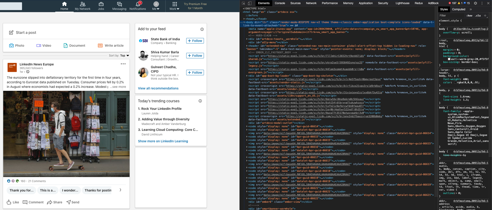
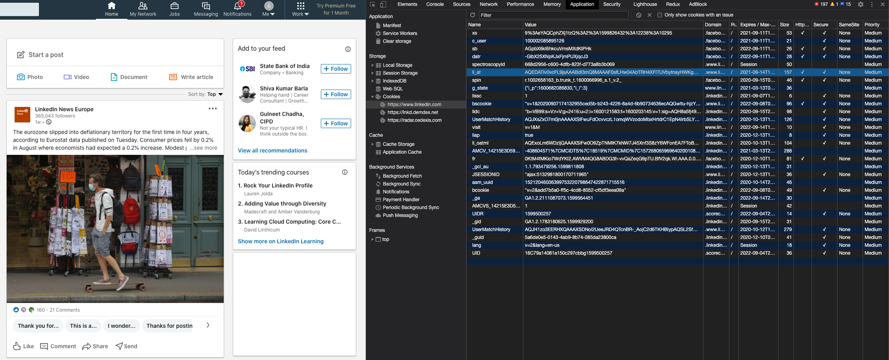
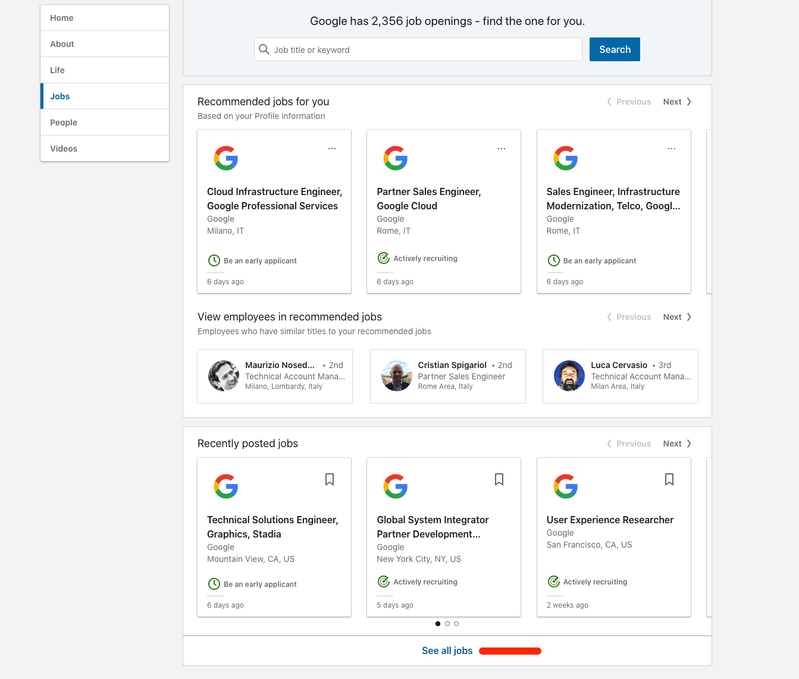

# linkedin-jobs-scraper
> Scrape public available jobs on Linkedin using a headless browser. For each job the following
> fields are extracted: `jobId`, `title`, `company`, `[companyLink]`, `[companyEmployeeCount]`,
> `[companyImgLink]`, `place`, `date`, `dateText`, `link`, `[applyLink]`, `description`,
> `descriptionHTML`, `insights`, `[salary]`, `isEasyApply`, `[applicantCount]`, `[benefits]`,
> `reposted`. <br><br>
> It's also available an equivalent [package in python](https://github.com/spinlud/py-linkedin-jobs-scraper).

<span style="color:red">⚠ **DISCLAIMER** This package is meant for personal or educational use only. All the data extracted by
using this package is publicly available on the LinkedIn website and it remains owned by LinkedIn company.
I am not responsible in any way for the inappropriate use of data extracted through this library.
</span>

## Table of Contents

<!-- toc -->

* [Installation](#installation)
* [Usage](#usage)
* [LinkedinScraper](#linkedinscraper)
* [Authenticated session](#authenticated-session)
* [Rate limiting](#rate-limiting)
* [Filters](#filters)
* [Company filter](#company-filter)
* [CLI](#cli)
* [Logger](#logger)
* [License](#license)

<!-- toc stop -->


## Installation
Requires Node >= 22 and a local [Chrome](https://www.google.com/intl/en_us/chrome/) or
[Chromium](https://www.chromium.org/getting-involved/download-chromium) (Puppeteer downloads one on
install by default).

```shell
npm install --save linkedin-jobs-scraper
```


## Usage

This port is **authenticated only**: every run needs a LinkedIn session. The quickest way to
provide one is the `LI_AT_COOKIE` environment variable holding your `li_at` session cookie; see
[Authenticated session](#authenticated-session) for how to obtain it and for the other supported
modes.

```ts
import {
    LinkedinScraper,
    relevanceFilter,
    timeFilter,
    typeFilter,
    experienceLevelFilter,
    onSiteOrRemoteFilter,
    baseSalaryFilter,
    events,
} from "linkedin-jobs-scraper";

(async () => {
    // Each scraper instance is associated with one browser.
    // Concurrent queries will run on different pages within the same browser instance.
    // Authentication is mandatory: with LI_AT_COOKIE exported the session is picked up from the
    // environment, or pass it explicitly through the `auth` option.
    const scraper = new LinkedinScraper({
        headless: true,
        pacing: {
            baseDelay: 2, // Floor on seconds slept between jobs. See "Rate limiting"
            adaptive: true, // Slow down automatically when LinkedIn throttles the run
        },
        args: [
            "--lang=en-GB",
        ],
    });

    // Emitted once per query/location before scraping starts, carrying LinkedIn's approximate
    // total result count (jobTotal is -1 when it could not be parsed).
    scraper.on(events.scraper.begin, (begin) => {
        console.log("Approximate total results:", begin.jobTotal);
    });

    // Emitted once for each processed job
    scraper.on(events.scraper.data, (data) => {
        console.log(
            data.description.length,
            data.descriptionHTML.length,
            `Query='${data.query}'`,
            `Location='${data.location}'`,
            `Id='${data.jobId}'`,
            `Title='${data.title}'`,
            `Company='${data.company ? data.company : "N/A"}'`,
            `CompanyLink='${data.companyLink ? data.companyLink : "N/A"}'`,
            `CompanyImgLink='${data.companyImgLink ? data.companyImgLink : "N/A"}'`,
            `Place='${data.place}'`,
            `Date='${data.date}'`,
            `DateText='${data.dateText}'`,
            `Link='${data.link}'`,
            `ApplyLink='${data.applyLink ? data.applyLink : "N/A"}'`,
            `Salary='${data.salary ? data.salary : "N/A"}'`,
            `IsEasyApply='${data.isEasyApply}'`,
            `ApplicantCount='${data.applicantCount ? data.applicantCount : "N/A"}'`,
            `Benefits='${data.benefits ? data.benefits.join(", ") : "N/A"}'`,
            `Reposted='${data.reposted}'`,
            `Insights='${data.insights}'`,
        );
    });

    // Emitted once for each scraped page (25 jobs)
    scraper.on(events.scraper.metrics, (metrics) => {
        console.log(
            `Processed=${metrics.processed}`,
            `Failed=${metrics.failed}`,
            `Missed=${metrics.missed}`,
            `Skipped=${metrics.skipped}`,
            `Throttled=${metrics.throttled}`,
            `Pace=${metrics.pace}s`,
        );
    });

    scraper.on(events.scraper.error, (err) => {
        console.error(err);
    });

    scraper.on(events.scraper.end, () => {
        console.log("All done!");
    });

    // Custom function executed on browser side to extract job description [optional]
    const descriptionFn = () => {
        const description = document.querySelector<HTMLElement>(".jobs-description");
        return description ? description.innerText.replace(/[\s\n\r]+/g, " ").trim() : "N/A";
    };

    await scraper.run([
        {
            query: "Engineer",
            options: {
                locations: ["United States"], // This will override global options ["Europe"]
                filters: {
                    type: [typeFilter.FULL_TIME, typeFilter.CONTRACT],
                    onSiteOrRemote: [onSiteOrRemoteFilter.REMOTE, onSiteOrRemoteFilter.HYBRID],
                    baseSalary: baseSalaryFilter.SALARY_100K,
                },
            },
        },
        {
            query: "Sales",
            options: {
                pageOffset: 2, // How many pages to skip. Default 0
                limit: 10, // This will override the global option limit (33)
                applyLink: true, // Try to extract the apply link. Slower, because an extra page is navigated. Default false
                skipPromotedJobs: true, // Skip promoted jobs. Default false
                descriptionFn: descriptionFn, // Custom job description processor [optional]
            },
        },
    ], {
        // Global options, merged individually with each query's options
        locations: ["Europe"],
        limit: 33,
    });

    // Close browser
    await scraper.close();
})();
```


## LinkedinScraper
Each `LinkedinScraper` instance is associated with one browser (Chromium) instance. Concurrent runs will be executed
 on different pages within the same browser. Package uses [puppeteer](https://github.com/puppeteer/puppeteer) under the hood
 to instantiate Chromium browser instances; the same browser options and events are supported.
 For more information about browser options see: [puppeteer launch options](https://pptr.dev/api/puppeteer.launchoptions).
 For more information about browser events see: [puppeteer browser events](https://pptr.dev/api/puppeteer.browser).

`pacing` and `auth` are the two scraper-specific options; everything else on the options object is
forwarded to `puppeteer.launch`.


## Authenticated session
The scraper requires a LinkedIn session (there is no anonymous mode). There are three ways to supply
one:

**1. Chrome profile (recommended).** Sign in once into a Chrome profile that the scraper then
reuses. The CLI `login` subcommand opens a visible browser for this:

```sh
lijs login --chrome-user-data-dir ~/.linkedin-jobs-scraper
```

Sign in there, ticking **"Keep me logged in"** so the profile can renew its own session. Then point
the scraper at the same profile:

```ts
const scraper = new LinkedinScraper({
    auth: { mode: "interactiveProfile", userDataDir: "~/.linkedin-jobs-scraper" },
});
```

On the CLI, `jobs` and `job` take `--chrome-user-data-dir <dir>` to reuse the profile, and
`--interactive-login` to sign in by hand on the first run when the profile holds no session yet
(requires `--chrome-user-data-dir` and a display).

**2. Remember-me cookie pair.** Export the `li_rm` and `bcookie` values (both are required) that the
`login` command prints at the end of a sign-in; LinkedIn mints a fresh session from them on each run:

```sh
export LI_RM_COOKIE='<li_rm value>'
export LI_BCOOKIE='<bcookie value>'
node app.js
```

**3. Bare `li_at` session cookie.** Copy the `li_at` cookie straight from your own Chrome browser.
Sign in to LinkedIn, then open Chrome developer tools:



Go to tab `Application`, then from the left panel select `Storage` -> `Cookies` ->
`https://www.linkedin.com`. In the main view locate the row named `li_at` and copy the content of
the `Value` column.



Set the environment variable `LI_AT_COOKIE` with the value obtained above, then run your application
as normal:

```sh
LI_AT_COOKIE=<your li_at cookie value here> node app.js
```

This cookie cannot be renewed: LinkedIn expires it after a while, and a run that loses it stops.
Expect to replace it by hand; prefer the Chrome profile or the remember-me pair when you can.

Each mode can also be passed explicitly through the `auth` option instead of the environment:
`{ mode: "interactiveProfile", userDataDir }`, `{ mode: "rememberMe", liRm, bcookie }`, or
`{ mode: "liAt", liAt }`.


## Rate limiting
You may experience the following rate limiting warning during execution: `429 too many requests`.
This means you are exceeding the number of requests per second allowed by the server (this is
especially true with authenticated sessions, where the rate limits are much stricter). Pacing is
controlled by the `pacing` option:

- `baseDelay`: seconds slept between jobs, the floor the pace never eases below. Minimum `0.2`,
  default `0.8`.
- `adaptive`: when `true` (default) `baseDelay` is only the fastest the run will ever go, not a
  fixed delay: the run starts at that speed and slows itself down whenever LinkedIn pushes back,
  then eases back towards `baseDelay`. Set it to `false` to keep `baseDelay` fixed.

With adaptive pacing on:

- **On every 429**, the delay between jobs doubles, up to `min(10, baseDelay * 10)` seconds.
- **After 20 jobs in a row without a 429**, the delay eases back towards `baseDelay`, and never
  goes below it.

The `metrics` event reports both `throttled` (how many 429s the run has met) and `pace` (the delay
currently slept between jobs).

```ts
const scraper = new LinkedinScraper({
    headless: true,
    pacing: {
        baseDelay: 2,
        adaptive: true,
    },
    args: [
        "--lang=en-GB",
    ],
});
```


## Filters

It is possible to customize queries with the following filters:

- RELEVANCE:
  * `RELEVANT`
  * `RECENT`
- TIME:
  * `ANY`
  * `DAY`
  * `WEEK`
  * `MONTH`
- TYPE:
  * `FULL_TIME`
  * `PART_TIME`
  * `TEMPORARY`
  * `CONTRACT`
  * `INTERNSHIP`
  * `VOLUNTEER`
  * `OTHER`
- EXPERIENCE LEVEL:
  * `INTERNSHIP`
  * `ENTRY_LEVEL`
  * `ASSOCIATE`
  * `MID_SENIOR`
  * `DIRECTOR`
  * `EXECUTIVE`
- ON SITE OR REMOTE:
  * `ON_SITE`
  * `REMOTE`
  * `HYBRID`
- INDUSTRY:
  * `AIRLINES_AVIATION`
  * `BANKING`
  * `CIVIL_ENGINEERING`
  * `COMPUTER_GAMES`
  * `ENVIRONMENTAL_SERVICES`
  * `ELECTRONIC_MANUFACTURING`
  * `FINANCIAL_SERVICES`
  * `INFORMATION_SERVICES`
  * `INVESTMENT_BANKING`
  * `INVESTMENT_MANAGEMENT`
  * `IT_SERVICES`
  * `LEGAL_SERVICES`
  * `MOTOR_VEHICLES`
  * `OIL_GAS`
  * `SOFTWARE_DEVELOPMENT`
  * `STAFFING_RECRUITING`
  * `TECHNOLOGY_INTERNET`
- BASE SALARY:
  * `SALARY_40K`
  * `SALARY_60K`
  * `SALARY_80K`
  * `SALARY_100K`
  * `SALARY_120K`
  * `SALARY_140K`
  * `SALARY_160K`
  * `SALARY_180K`
  * `SALARY_200K`
- JOB FUNCTION:
  * `ACCOUNTING_AUDITING`
  * `ADMINISTRATIVE`
  * `ADVERTISING`
  * `BUSINESS_DEVELOPMENT`
  * `CONSULTING`
  * `DISTRIBUTION`
  * `DESIGN`
  * `EDUCATION`
  * `ENGINEERING`
  * `FINANCE`
  * `GENERAL_BUSINESS`
  * `HEALTH_CARE_PROVIDER`
  * `HUMAN_RESOURCES`
  * `INFORMATION_TECHNOLOGY`
  * `LEGAL`
  * `MANAGEMENT`
  * `MANUFACTURING`
  * `MARKETING`
  * `OTHER`
  * `PUBLIC_RELATIONS`
  * `PRODUCT_MANAGEMENT`
  * `PROJECT_MANAGEMENT`
  * `QUALITY_ASSURANCE`
  * `RESEARCH`
  * `SALES`
  * `SUPPLY_CHAIN`
  * `TRAINING`
- BENEFITS:
  * `MEDICAL`
  * `VISION`
  * `DENTAL`
  * `RETIREMENT_401K`
  * `PENSION_PLAN`
  * `PAID_MATERNITY_LEAVE`
  * `PAID_PATERNITY_LEAVE`
  * `COMMUTER_BENEFITS`
  * `STUDENT_LOAN_ASSISTANCE`
  * `TUITION_ASSISTANCE`
  * `DISABILITY_INSURANCE`
- COMMITMENTS:
  * `DIVERSITY_EQUITY_INCLUSION`
  * `ENVIRONMENTAL_SUSTAINABILITY`
  * `WORK_LIFE_BALANCE`
  * `SOCIAL_IMPACT`
  * `CAREER_GROWTH_AND_LEARNING`
- EASY APPLY: `easyApply: true` restricts results to jobs with LinkedIn Easy Apply.
- UNDER 10 APPLICANTS: `under10Applicants: true` restricts results to jobs with fewer than 10 applicants.
- COMPANY:
  * See below

The package root exports the `relevanceFilter`, `timeFilter`, `typeFilter`,
`experienceLevelFilter`, `onSiteOrRemoteFilter`, `baseSalaryFilter`, `industryFilter`,
`jobFunctionFilter`, `benefitsFilter` and `commitmentsFilter` constants, so every filter can be
referenced by name rather than by its raw LinkedIn code (the CLI exposes the same filters as
`--industry`, `--job-function`, `--benefits` and `--commitments`). The `Location` class is exported
too, letting `locations` be pinned to a LinkedIn geoId instead of a location name.

See the following example for more details:

```ts
import {
  LinkedinScraper,
  relevanceFilter,
  timeFilter,
  typeFilter,
  experienceLevelFilter,
  onSiteOrRemoteFilter,
  baseSalaryFilter,
  industryFilter,
  Location,
  events,
} from "linkedin-jobs-scraper";

// jobFunctionFilter, benefitsFilter and commitmentsFilter are importable the same way.

(async () => {
  // [...]

  await scraper.run({
    query: "Software Engineer",
    options: {
      // A Location pins the search to a LinkedIn geoId; a plain string is looked up by name.
      locations: [new Location("103644278", "United States")],
      filters: {
        relevance: relevanceFilter.RELEVANT,
        time: timeFilter.MONTH,
        type: [typeFilter.FULL_TIME, typeFilter.CONTRACT],
        experience: [experienceLevelFilter.ENTRY_LEVEL, experienceLevelFilter.MID_SENIOR],
        onSiteOrRemote: [onSiteOrRemoteFilter.REMOTE, onSiteOrRemoteFilter.HYBRID],
        baseSalary: baseSalaryFilter.SALARY_100K,
        industry: [industryFilter.SOFTWARE_DEVELOPMENT],
        easyApply: true,
        under10Applicants: true,
      },
    },
  });

  // [...]
})();
```

### Company Filter

It is also possible to filter by company using the public company jobs url on LinkedIn. To find this url you have to:
 1. Login to LinkedIn using an account of your choice.
 2. Go to the LinkedIn page of the company you are interested in (e.g. [https://www.linkedin.com/company/google](https://www.linkedin.com/company/google)).
 3. Click on `jobs` from the left menu.

 

 4. Scroll down and locate `See all jobs` or `See jobs` button.

 

 5. Right click and copy link address (or navigate the link and copy it from the address bar).
 6. Paste the link address in code as follows:

```ts
// [...]

await scraper.run({
    query: "",
    options: {
        filters: {
            // Copy link address here
            companyJobsUrl: "https://www.linkedin.com/jobs/search/?f_C=1441%2C17876832%2C791962%2C2374003%2C18950635%2C16140%2C10440912&geoId=92000000",
        },
    },
});

// [...]
```


## CLI

Installing the package also installs a command line interface: it scrapes straight from your shell,
no code required. Two equivalent commands are installed, `linkedin-jobs-scraper` and the short alias
`lijs`. The CLI mirrors the programmatic API but scrapes a single query per invocation.

```sh
linkedin-jobs-scraper --help   # full command
lijs --help                    # short alias
```

Like the library, the CLI is authenticated only. Before your first scrape, sign in once (see
[Authenticated session](#authenticated-session)):

```sh
lijs login --chrome-user-data-dir ~/.linkedin-jobs-scraper
```

### Subcommands

#### `jobs [query]`
Search and scrape jobs matching the query, locations and filters:

```sh
lijs jobs "software engineer" --location "United States" --location "Remote" --limit 50 \
  --chrome-user-data-dir ~/.linkedin-jobs-scraper
lijs jobs "data scientist" --geo-id 103644278 --time week --type full-time,contract \
  --experience mid-senior --on-site-or-remote remote --base-salary 120k --apply-link \
  --chrome-user-data-dir ~/.linkedin-jobs-scraper
```

#### `job <url-or-id>`
Scrape a single job by a bare id or a `/jobs/view/<id>` url, with an optional `--apply-link`:

```sh
lijs job 3690634839 --chrome-user-data-dir ~/.linkedin-jobs-scraper
lijs job https://www.linkedin.com/jobs/view/3690634839 --apply-link \
  --chrome-user-data-dir ~/.linkedin-jobs-scraper
```

#### `login`
Open a visible browser to sign in once into a reusable Chrome profile, then print the reuse commands
and the remember-me cookie pair ready to export. Requires `--chrome-user-data-dir`; also accepts
`--chrome-executable-path`.

```sh
lijs login --chrome-user-data-dir ~/.linkedin-jobs-scraper
```

### Global options

Accepted on the program and on every subcommand, before or after it:

| Flag | Description |
| --- | --- |
| `--no-color` | Disable coloured output (also honours the `NO_COLOR` environment variable). |
| `--quiet` | Suppress non-error output. |
| `-v`, `--verbose` | Increase verbosity, repeatable. `-v` enables info logs, `-vv` enables debug logs. |
| `--version` | Print the version and exit. |

### Driver options

Shared by `jobs` and `job`:

| Flag | Description | Default |
| --- | --- | --- |
| `--no-headless` | Run Chrome with a visible window. | headless |
| `--base-delay <seconds>` | Floor on seconds slept between jobs (see [Rate limiting](#rate-limiting)). | `0.8` |
| `--no-adaptive` | Keep the delay fixed instead of adapting to 429s. | adaptive |
| `--page-load-timeout <seconds>` | Page load timeout in seconds (accepted for parity; not yet wired to a library knob). | `20` |
| `--chrome-executable-path <path>` | Path to the Chrome executable. | |
| `--chrome-user-data-dir <dir>` | Chrome profile directory kept across runs (also the authentication source). | |
| `--interactive-login` | Sign in by hand into the profile before scraping (requires `--chrome-user-data-dir`). | |

### Search options

Accepted by `jobs`:

| Flag | Description | Default |
| --- | --- | --- |
| `query` (positional) | The search keywords. | |
| `--location <name>` | Location name, repeatable. Mutually exclusive with `--geo-id`. | |
| `--geo-id <id>` | LinkedIn geoId, repeatable. Pins the search deterministically. Mutually exclusive with `--location`. | |
| `--limit <n>` | Maximum jobs to scrape, `0` for unlimited (LinkedIn serves up to ~1000). | `25` |
| `--apply-link` | Resolve the external apply link for each job (slower). | |
| `--skip-promoted-jobs` | Skip promoted jobs. | |
| `--page-offset <n>` | Number of result pages to skip. | `0` |
| `--relevance <value>` | Sort order: `relevant`, `recent`. | |
| `--time <value>` | Time posted: `any`, `day`, `week`, `month`. | |
| `--base-salary <value>` | Minimum base salary: `40k`, `60k`, `80k`, `100k`, `120k`, `140k`, `160k`, `180k`, `200k`. | |
| `--company-jobs-url <url>` | LinkedIn company jobs url for the company filter. | |
| `--type <type>` | Job type, repeatable or comma-separated: `full-time`, `part-time`, `temporary`, `contract`, `internship`, `volunteer`, `other`. | |
| `--experience <level>` | Experience level, repeatable or comma-separated: `internship`, `entry-level`, `associate`, `mid-senior`, `director`, `executive`. | |
| `--on-site-or-remote <mode>` | Workplace, repeatable or comma-separated: `on-site`, `remote`, `hybrid`. | |
| `--industry <industry>` | Industry, repeatable or comma-separated (e.g. `software-development`, `banking`, `it-services`). | |
| `--job-function <function>` | Job function, repeatable or comma-separated (e.g. `engineering`, `sales`, `information-technology`). | |
| `--benefits <benefit>` | Benefits, repeatable or comma-separated (e.g. `medical`, `vision`, `dental`). | |
| `--commitments <commitment>` | Commitments, repeatable or comma-separated (e.g. `work-life-balance`, `social-impact`). | |
| `--easy-apply` | Only jobs with LinkedIn Easy Apply. | |
| `--under-10-applicants` | Only jobs with fewer than 10 applicants. | |

Run `lijs jobs --help` for the full list of accepted values for each enum flag.

### Output

Scraped **data** is written to **stdout**; progress, metrics and errors go to **stderr**, so piping
the data stream stays clean.

| Flag | Description |
| --- | --- |
| `-f`, `--out-format <format>` | Output format: `table`, `jsonl`, `json`, `csv`. |
| `-o`, `--out-path <path>` | Output destination; `-` means stdout. |
| `--fields <fields>` | Comma-separated list of fields to emit. |
| `--all-fields` | Emit every available field. |
| `--vertical` | Render one field per line. |
| `--raw` | Emit the raw record, without collapsing whitespace. |

**Format inference.** An explicit `-f` always wins. Otherwise the format is inferred from the
`--out-path` extension (`.csv`, `.json`, `.jsonl`); with no path it defaults to `table` on a TTY and
`jsonl` when piped. `table` never goes to a file: a file destination downgrades it to `jsonl`.

**Selectable fields (`--fields`).** In declaration order:
`query`, `location`, `jobId`, `jobIndex`, `link`, `applyLink`, `title`, `company`, `companyLink`,
`companyEmployeeCount`, `companyImgLink`, `place`, `date`, `dateText`, `description`,
`descriptionHTML`, `insights`, `salary`, `isEasyApply`, `applicantCount`, `benefits`, `reposted`.

When no fields are selected, the `table` format shows a default column set
(`title`, `company`, `place`, `date`, `salary`, `applicantCount`, `benefits`, `reposted`, `link`);
every other format emits all fields. `--all-fields` forces the full set in any format.

**Table layout.** Each row is prefixed with an `index` column: a per-section ordinal that resets at
the start of every `(query, location)` section. In `--vertical` mode there is no index column;
instead each record is headed `── Job N ──`.

**Clickable URLs.** In the `table` format on a TTY, URL fields (`link`, `applyLink`, `companyLink`,
`companyImgLink`) are rendered as OSC 8 terminal hyperlinks: the cell shows a compact label while
clicking opens the full URL. Structured formats (`jsonl`, `json`, `csv`) always carry the full,
unmodified URLs.

**Run summary.** At the end of a run a `done:` summary is printed to stderr. A single-location run
prints one line, `done: processed=… failed=… missed=… skipped=… throttled=… pace=…s`. A
multi-location run prints `done:` followed by one row per location
(`processed=… failed=… missed=… skipped=…`) and a final `total` row that sums those counts and
carries `throttled`/`pace` from the last location that reported metrics.

### Exit codes

| Code | Meaning |
| --- | --- |
| `0` | Success |
| `1` | Generic error |
| `2` | Invalid or refused session |
| `3` | Job not found (`job`) |


## Logger
Logger uses the [debug](https://github.com/visionmedia/debug) package under the hood. The following namespaces are used:
* `scraper:debug`
* `scraper:info`
* `scraper:warn`
* `scraper:error`

Use the environment variable `DEBUG` or the programmatic API to selectively enable/disable one or more namespaces.
Example:

```sh
DEBUG=scraper:info node app.js
```

## License
[MIT License](http://en.wikipedia.org/wiki/MIT_License)

If you like the project and want to contribute you can [donate something here](https://paypal.me/spinlud)!
